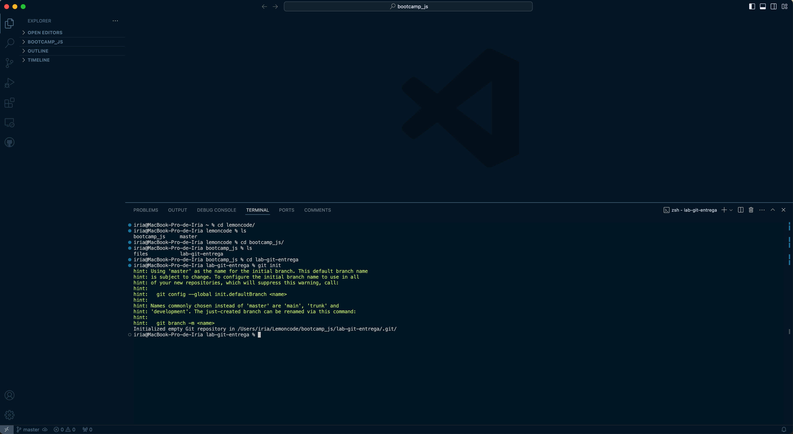
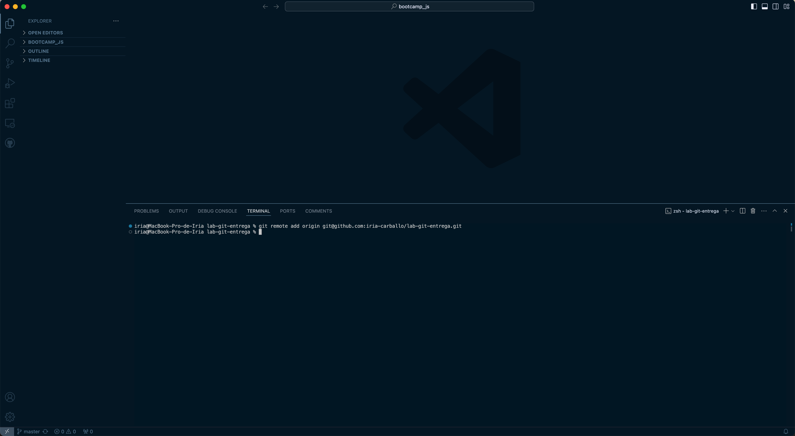
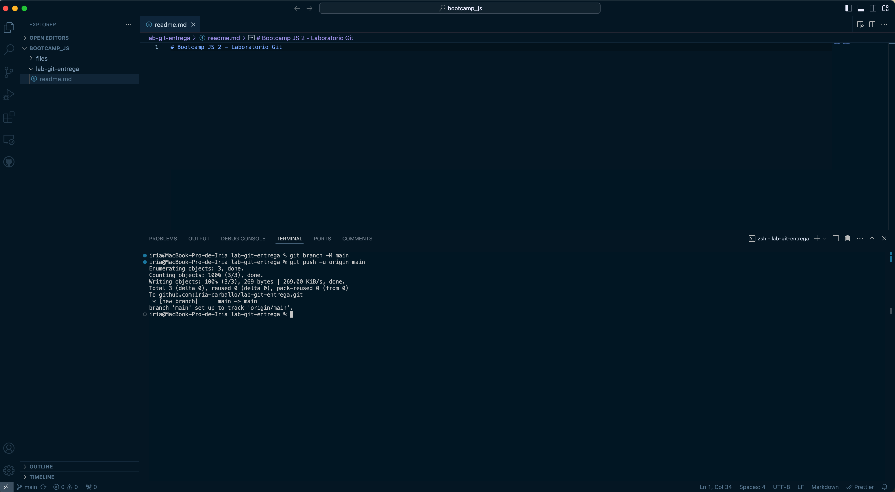
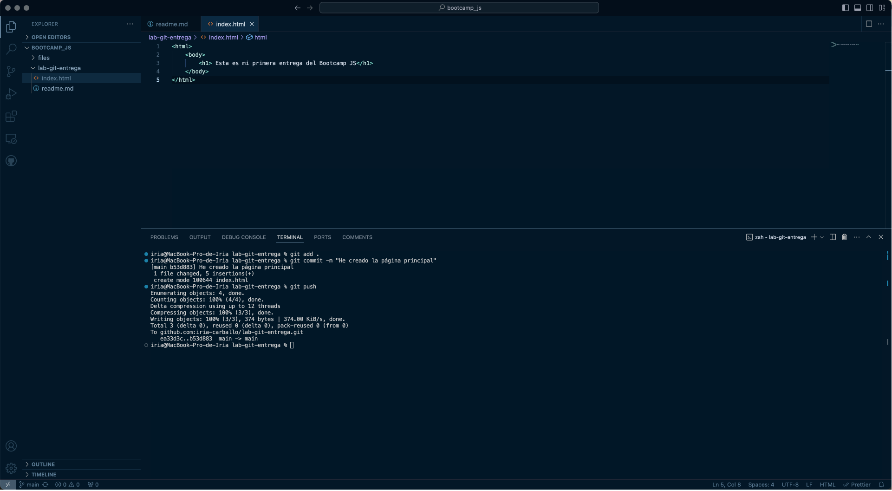
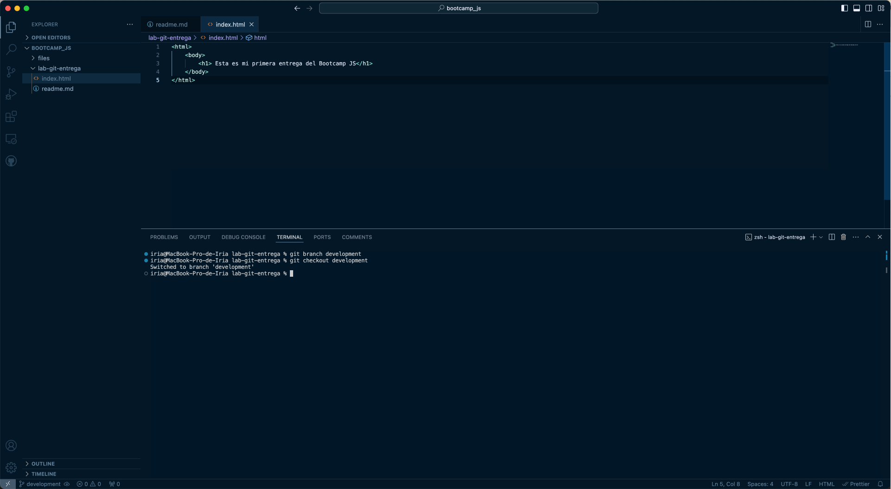
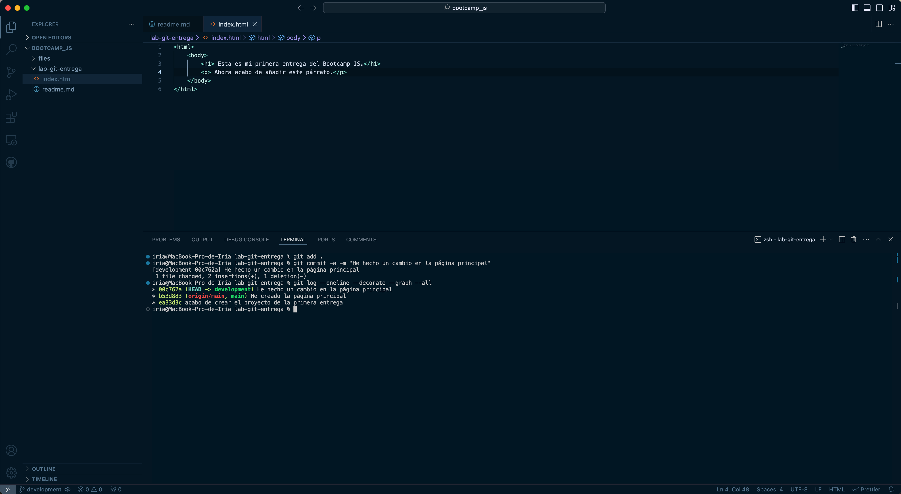
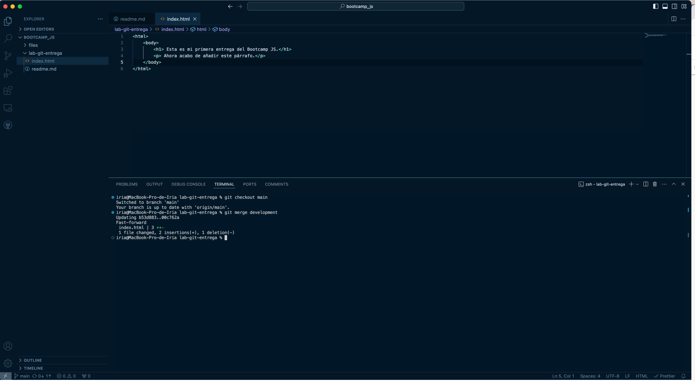

# Bootcamp JS 2 - Laboratorio Git

## 1. Crear un repositorio en local

Primero he navegado con la terminal hasta donde iba a crear el repositorio, he creado la carpeta y he inicializado el repositorio de Git.

****

## 2 . Subir el repositorio a GitHub

He creado un nuevo repositorio en GitHub y conectado mi repositorio local.

***

## 3 . Hacer un commit y push

He creado el archivo index.html, añadido el mismo al staging y he hecho commit con el mensaje "He creado la página principal".

***

## 4. Crear una rama

He creado una nueva rama llamada development y he añadido un nuevo párrafo al archivo index.html para después subir los cambios a Github.

***

## 5. Hacer un merge

He vuelto a la rama main, hecho un merge de la rama development a main y un push de los cambios al repositorio de GitHub.

